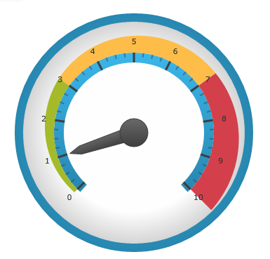
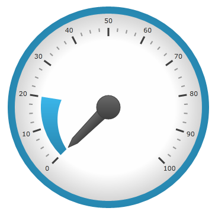

////
|metadata|
{
    "name": "radialgauge-configuring-ranges",
    "tags": ["Getting Started","How Do I"],
    "controlName": ["{RadialGaugeName}"],
    "guid": "456ea3c4-09e4-400a-ae84-50f2772b4ce3",
    "buildFlags": ["SL","WPF","XAMARIN","ANDROID","WINFORMS"],
    "createdOn": "2014-06-05T19:53:11.9788554Z"
}
|metadata|
////

= Configuring Ranges ({RadialGaugeName})

== Topic Overview

=== Purpose

This topic provides a conceptual overview of the  _{RadialGaugeName}_™ control’s ranges. It describes the properties of the ranges and provides an example of how to add ranges to the radial gauge.

=== Required background

The following topics are prerequisites to understanding this topic:

[options="header", cols="a,a"]
|====
|Topic|Purpose

| link:radialgauge.html[{RadialGaugeName}]
|This section gives you an overview of the _{RadialGaugeName}_™ control and its main features.

| link:radialgauge-getting-started-with-radialgauge.html[Adding {RadialGaugeName}]
|This topic explains using a code example how to add the _{RadialGaugeName}_™ control to a {PlatformName} application.

|====

=== In this topic

This topic contains the following sections:

* <<Overview,Ranges Overview>>
* <<Preview,Preview>>
* <<Properties,Range Properties>>
* <<Example,Configuring the Range>>
* <<RelatedContent,Related Content>>

[[Overview]]
== Ranges Overview

=== Ranges overview

A range highlights a set of continuous values bound by a specified minimum and maximum value on a gauge scale. You can add multiple ranges to a scale, specifying different brushes, along with starting and ending values. To add a range to the  _{RadialGaugeName}_   control, create a link:{RadialGaugeLink}.{RadialGaugeRange}.html[{RadialGaugeRange}] object and add it to the Ranges collection.

[[Preview]]

=== Preview

The following image is a preview of the {RadialGaugeName} control with the three ranges added to it (0-3; 3-7 and 7-10).

[[Properties]]
== Range Properties

=== Range properties summary

The following table summarizes the properties of the link:{RadialGaugeLink}.{RadialGaugeRange}.html[{RadialGaugeRange}].

[options="header", cols="a,a,a"]
|====
|Property Name|Property Type|Description

| link:{RadialGaugeLink}.{RadialGaugeRange}{ApiProp}brush.html[Brush]
|`Brush`
|The color assigned to the range

| link:{RadialGaugeLink}.{RadialGaugeRange}{ApiProp}startvalue.html[StartValue]
|`Double`
|The starting value at which to begin the range

| link:{RadialGaugeLink}.{RadialGaugeRange}{ApiProp}endvalue.html[EndValue]
|`Double`
|The ending value at which to end the range

| link:{RadialGaugeLink}.{RadialGaugeRange}{ApiProp}innerstartextent.html[InnerStartExtent]
|`Double`
|The distance from the center of the gauge (typically from 0 to 1) at which to start rendering the inner sweep of the range. Use values further from 0 than 1 to make the range extend beyond the normal radius of the gauge.

| link:{RadialGaugeLink}.{RadialGaugeRange}{ApiProp}innerendextent.html[InnerEndExtent]
|`Double`
|The distance from the center of the gauge (typically from 0 to 1) at which to end rendering the inner sweep of the range. Use values further from 0 than 1 to make the range extend further than the normal radius of the gauge.

| link:{RadialGaugeLink}.{RadialGaugeRange}{ApiProp}outerstartextent.html[OuterStartExtent]
|`Double`
|The distance from the center of the gauge (from 0 to 1) at which to start rendering the outer sweep of the range. Use values further from 0 than 1 to make this extend further than the normal radius of the gauge.

| link:{RadialGaugeLink}.{RadialGaugeRange}{ApiProp}outerendextent.html[OuterEndExtent]
|`Double`
|The distance from the center of the gauge (from 0 to 1) at which to end rendering the outer sweep of the range. Use values further from 0 than 1 to make this extend further than the normal radius of the gauge.

|====

[[Example]]
== Configuring the Range

=== Example

The following screenshot demonstrates how the {RadialGaugeName} control renders using this link:{RadialGaugeLink}.{RadialGaugeRange}.html[{RadialGaugeRange}] configuration:

[options="header", cols="a,a"]
|====
|Property|Value

| link:{RadialGaugeLink}.{RadialGaugeRange}{ApiProp}brush.html[Brush]
|Blue

| link:{RadialGaugeLink}.{RadialGaugeRange}{ApiProp}startvalue.html[StartValue]
|0

| link:{RadialGaugeLink}.{RadialGaugeRange}{ApiProp}endvalue.html[EndValue]
|20

| link:{RadialGaugeLink}.{RadialGaugeRange}{ApiProp}outerstartextent.html[OuterStartExtent]
|0.5

| link:{RadialGaugeLink}.{RadialGaugeRange}{ApiProp}outerendextent.html[OuterEndExtent]
|0.4

|====

Following is the code that implements this example

ifdef::xaml[]

*In XAML:*

[source,xaml]
----
<ig:{RadialGaugeName} x:Name="radialGauge" >
   <ig:{RadialGaugeName}.Ranges>
      <ig:{RadialGaugeRange}
         Brush="blue" 
         StartValue="0"
         EndValue="20"
         OuterStartExtent=".5"
         OuterEndExtent=".4"/>
   </ig:{RadialGaugeName}.Ranges>
</ig:{RadialGaugeName}>
----

endif::xaml[]

ifdef::sl,wpf,win-forms,win-universal,xamarin[]

*In C#:*

ifdef::wpf[]
----
var range1 = new {RadialGaugeRange}
range1.Brush = new SolidColorBrush(Colors.Blue);
range1.StartValue = 0;
range1.EndValue = 20;
range1.OuterStartExtent = 0.5;
range1.OuterEndExtent = 0.4;
radialGauge.Ranges.Add(range1);
----
endif::wpf[]

ifdef::win-forms[]
----
var range1 = new {RadialGaugeRange} RadialGaugeRange(); 
range1.Brush = new SolidColorBrush(Colors.Blue);
range1.StartValue = 0;
range1.EndValue = 20;
range1.OuterStartExtent = 0.5;
range1.OuterEndExtent = 0.4;
radialGauge.Ranges.Add(range1);
----
endif::win-forms[]

ifdef::xamarin[]
----
var range1 = new {RadialGaugeRange}   
range1.Brush = new SolidColorBrush(Colors.Blue);
range1.StartValue = 0;
range1.EndValue = 20;
range1.OuterStartExtent = 0.5;
range1.OuterEndExtent = 0.4;
radialGauge.Ranges.Add(range1);
----
endif::xamarin[]

ifdef::win-universal[]
----
var range1 = new {RadialGaugeRange}   
range1.Brush = new SolidColorBrush(Colors.Blue);
range1.StartValue = 0;
range1.EndValue = 20;
range1.OuterStartExtent = 0.5;
range1.OuterEndExtent = 0.4;
radialGauge.Ranges.Add(range1);
----
endif::win-universal[]

ifdef::sl[]
----
var range1 = new     
range1.Brush = new SolidColorBrush(Colors.Blue);
range1.StartValue = 0;
range1.EndValue = 20;
range1.OuterStartExtent = 0.5;
range1.OuterEndExtent = 0.4;
radialGauge.Ranges.Add(range1);
----
endif::sl[]

endif::sl,wpf,win-forms,win-universal,xamarin[]

ifdef::sl,wpf,win-forms,win-universal,xamarin[]

*In Visual Basic:*

ifdef::sl[]
----
Dim range1 As  {RadialGaugeRange}    = New  {RadialGaugeRange}   
range1.Brush = New SolidColorBrush(Colors.Blue)
range1.StartValue = 0range1.EndValue = 20
range1.OuterStartExtent = 0.5
range1.OuterEndExtent = 0.4
radialGauge.Ranges.Add(range1)
----
endif::sl[]

ifdef::wpf[]
----
Dim range1 As  {RadialGaugeRange}    = New  {RadialGaugeRange}   
range1.Brush = New SolidColorBrush(Colors.Blue)
range1.StartValue = 0range1.EndValue = 20
range1.OuterStartExtent = 0.5
range1.OuterEndExtent = 0.4
radialGauge.Ranges.Add(range1)
----
endif::wpf[]

ifdef::win-forms[]
----
Dim range1 As  {RadialGaugeRange}  RadialGaugeRange  = New  {RadialGaugeRange}  RadialGaugeRange() 
range1.Brush = New SolidColorBrush(Colors.Blue)
range1.StartValue = 0range1.EndValue = 20
range1.OuterStartExtent = 0.5
range1.OuterEndExtent = 0.4
radialGauge.Ranges.Add(range1)
----
endif::win-forms[]

ifdef::win-universal[]
----
Dim range1 As  {RadialGaugeRange}    = New  {RadialGaugeRange}   
range1.Brush = New SolidColorBrush(Colors.Blue)
range1.StartValue = 0range1.EndValue = 20
range1.OuterStartExtent = 0.5
range1.OuterEndExtent = 0.4
radialGauge.Ranges.Add(range1)
----
endif::win-universal[]

ifdef::xamarin[]
----
Dim range1 As  {RadialGaugeRange}    = New  {RadialGaugeRange}   
range1.Brush = New SolidColorBrush(Colors.Blue)
range1.StartValue = 0range1.EndValue = 20
range1.OuterStartExtent = 0.5
range1.OuterEndExtent = 0.4
radialGauge.Ranges.Add(range1)
----
endif::xamarin[]

endif::sl,wpf,win-forms,win-universal,xamarin[]

ifdef::android[]

*In Java:*

[source,js]
----
RadialGaugeRange range1 = new RadialGaugeRange();
range1.setBrush(new SolidColorBrush(Color.BLUE));
range1.setStartValue(0);
range1.setEndValue(20);
range1.setOuterStartExtent(.5);
range1.setOuterEndExtent(.4);
radialGauge.addRange(range1);
----

endif::android[]

[[RelatedContent]]
== Related Content

=== Topics

The following topics provide additional information related to this topic:

[options="header", cols="a,a"]
|====
|Topic|Purpose

| link:radialgauge-getting-started-with-radialgauge.html[Adding {RadialGaugeName}]
|This topic explains using a code example how to add the _{RadialGaugeName}_™ control to a {PlatformName} application.

| link:radialgauge-configuring-the-backing.html[Configuring the Background ({RadialGaugeName})]
|This topic provides a conceptual overview of the _{RadialGaugeName}_™ control’s backing feature. It describes the properties of the backing area and provides an example of its implementation.

| link:radialgauge-configuring-labels.html[Configuring Labels ({RadialGaugeName})]
|This topic provides a conceptual overview of labels with the {RadialGaugeName}™ control. It describes the properties of the labels and also provides an example of how to configure the labels.

| link:radialgauge-configuring-needles.html[Configuring Needles ({RadialGaugeName})]
|This topic provides a conceptual overview of needles with the {RadialGaugeName}™ control. It describes the properties of the needles and also provides an example of how to configure them.

| link:radialgauge-configuring-the-scale.html[Configuring the Scale ({RadialGaugeName})]
|This topic provides a conceptual overview of the {RadialGaugeName}™ control’s scale. It describes the properties of the scale and also provides an example of how to implement it.

| link:radialgauge-configuring-tick-marks.html[Configuring the Tick Marks ({RadialGaugeName})]
|This topic provides a conceptual overview of tick marks with the {RadialGaugeName}™ control. It describes the tick marks’ properties and provides an example of how to implement them.

|====

ifdef::sl,wpf[]

=== Samples

ifdef::sl,wpf[]

The following samples provide additional information related to this topic.

[options="header", cols="a,a"]
|====
|Sample|Purpose

| link:{SamplesURL}/radial-gauge/#/bind-to-live-data[Bind to Live Data]
|In this sample, the gauge’s needle value is bound to live data and updated once every five seconds in the Tick event handler of a Timer.

| link:{SamplesURL}/radial-gauge/#/events[Events]
|This sample demonstrates the Radial Gauge control’s events. You can watch the events in the Events Log below.

| link:{SamplesURL}/radial-gauge/#/gauge-animation[Gauge Animation]
|This sample demonstrates how you can easily animate the Radial Gauge by setting the link:{RadialGaugeLink}.{RadialGaugeName}~transitionduration.html[TransitionDuration] property.

| link:{SamplesURL}/radial-gauge/#/gauge-needle[Gauge Needle]
|Displayed as a pointer, the Needle indicates a single value on a scale. The options pane below allows you to interact with the Radial Gauge control’s Needle.

| link:{SamplesURL}/radial-gauge/#/label-settings[Label Settings]
|This sample demonstrates how to configure the Radial Gauge control’s Label settings. Use the slider to see how the link:{RadialGaugeLink}.{RadialGaugeName}~labelinterval.html[LabelInterval] and link:{RadialGaugeLink}.{RadialGaugeName}~labelextent.html[LabelExtent] properties affect the Label.

| link:{SamplesURL}/radial-gauge/#/needle-dragging[Needle Dragging]
|This sample demonstrates how you can drag the Radial Gauge control’s needle by using the Mouse events.

| link:{SamplesURL}/radial-gauge/#/range[Range]
|A range is a visual element that highlights a specified range of values on a scale. Use the options pane below to set the Radial Gauge control’s Range properties.

| link:{SamplesURL}/radial-gauge/#/scale-settings[Scale Settings]
|A scale defines a range of values in the Radial Gauge. Use the options pane below to set the Radial Gauge control’s Scale properties.

| link:{SamplesURL}/radial-gauge/#/tickmarks[Tick Marks]
|Tick marks can be displayed at every user specified interval on a gauge. Use the options pane below to set the Radial Gauge control’s Tick Mark properties.

|====

endif::sl,wpf[]

endif::sl,wpf[]