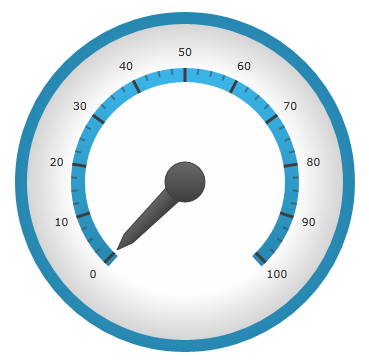
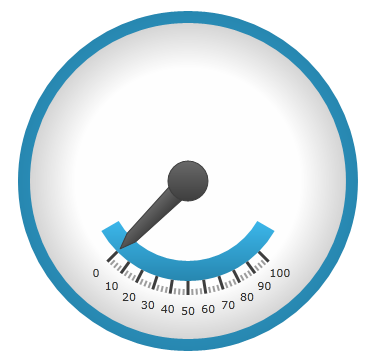

////
|metadata|
{
    "name": "radialgauge-configuring-the-scale",
    "tags": ["Getting Started","How Do I"],
    "controlName": ["{RadialGaugeName}"],
    "guid": "8be0eac7-4e8f-4cc4-9e43-b1fc68d1f353",
    "buildFlags": ["SL","WPF","XAMARIN","ANDROID","WINFORMS"],
    "createdOn": "2014-06-05T19:53:11.9808565Z"
}
|metadata|
////

= Configuring the Scale ({RadialGaugeName})

== Topic Overview

=== Purpose

This topic provides a conceptual overview of the  _{RadialGaugeName}_™ control’s scale. It describes the properties of the scale and also provides an example of how to implement it.

=== Required background

The following topics are prerequisites to understanding this topic:

[options="header", cols="a,a"]
|====
|Topic|Purpose

| link:radialgauge.html[{RadialGaugeName}]
|This section gives you an overview of the _{RadialGaugeName}_™ control and its main features.

| link:radialgauge-getting-started-with-radialgauge.html[Adding {RadialGaugeName}]
|This topic explains using a code example how to add the _{RadialGaugeName}_™ control to a {PlatformName} application.

|====

=== In this topic

This topic contains the following sections:

* <<Overview,Scale Overview>>
* <<Preview,Preview>>
* <<Properties,Scale Properties>>
* <<Configuring,Configuring the Scale>>
* <<RelatedContent,Related Content>>

[[Overview]]
== Scale Overview

=== Scale overview

Used to represent the values of the gauge visually, a scale defines a range of values in the  _{RadialGaugeName}_  control. The tick marks and ranges are all the elements that can be added to a scale.

[[Preview]]

=== Preview

The following image is a preview of the  _{RadialGaugeName}_  control with the scale added.

[[Properties]]
== Scale Properties

=== Scale properties summary

The following table summarizes the properties of the  _{RadialGaugeName}_   control related to the scale.

[options="header", cols="a,a,a"]
|====
|Property Name|Property Type|Description

| link:{RadialGaugeLink}.{RadialGaugeName}{ApiProp}scalestartextent.html[ScaleStartExtent]
|`Double`
|Specifies the starting position of the scale measured from the center of the gauge. The value of this property should be between 0 and 1. 

Setting this property to a value greater than the link:{RadialGaugeLink}.{RadialGaugeName}{ApiProp}scaleendextent.html[ScaleEndExtent] property will result in the start extent defaulting back to the actual link:{RadialGaugeLink}.{RadialGaugeName}{ApiProp}scaleendextent.html[ScaleEndExtent] value.

| link:{RadialGaugeLink}.{RadialGaugeName}{ApiProp}scaleendextent.html[ScaleEndExtent]
|`Double`
|Specifies the end position of the scale measured from the center of the gauge. The value of this property should be between 0 and 1. 

Setting this property to a value less than the link:{RadialGaugeLink}.{RadialGaugeName}{ApiProp}scalestartextent.html[ScaleStartExtent] property will result in the end extent defaulting back to the actual link:{RadialGaugeLink}.{RadialGaugeName}{ApiProp}scalestartextent.html[ScaleStartExtent] value.

| link:{RadialGaugeLink}.{RadialGaugeName}{ApiProp}scalestartangle.html[ScaleStartAngle]
|`Double`
|Specifies the start angle for the scale in degrees.

| link:{RadialGaugeLink}.{RadialGaugeName}{ApiProp}scaleendangle.html[ScaleEndAngle]
|`Double`
|Specifies the end angle for the scale in degrees.

| link:{RadialGaugeLink}.{RadialGaugeName}{ApiProp}scaleoversweep.html[ScaleOversweep]
|`Double`
|Specifies the amount of extra space (in degrees) the scale sweeps, in both directions, beyond the start and end values. This value must be greater than 0. The default value is 3.

| link:{RadialGaugeLink}.{RadialGaugeName}{ApiProp}scalebrush.html[ScaleBrush]
|`Brush`
|Specifies the brush used to fill the background of the scale.

| link:{RadialGaugeLink}.{RadialGaugeName}{ApiProp}scalesweepdirection.html[ScaleSweepDirection]
|SweepDirection
|Specifies whether the scale sweeps clockwise or counterclockwise.

| link:{RadialGaugeLink}.{RadialGaugeName}{ApiProp}scaleoversweepshape.html[ScaleOversweepShape]
| pick:[android,wpf,win-universal=" link:{RadialGaugeLink}.radialgaugescaleoversweepshape.html[RadialGaugeScaleOversweepShape]"] pick:[xamarin=" link:{RadialGaugeLinkBase}.radialgaugescaleoversweepshape.html[RadialGaugeScaleOversweepShape]"] 

|
ifdef::sl,wpf,win-forms,xamarin,win-universal[] 

*Circular* - Increases the angle at which the ends of the shape is drawn 

endif::sl,wpf,win-forms,xamarin,win-universal[] 

ifdef::android[] 

*CIRCULAR* - Increases the angle at which the ends of the shape is drawn 

endif::android[] 

ifdef::sl,wpf,win-forms,xamarin,win-universal[] 

*Fitted* - Increase the angle of the outer and inner arc, but increases the angle of the inner arc more in order to keep the connecting lines of the scale shape parallel with where they would have been if the link:{RadialGaugeLink}.{RadialGaugeName}{ApiProp}scaleoversweep.html[ScaleOversweep] property was set to 0. 

endif::sl,wpf,win-forms,xamarin,win-universal[] 

ifdef::android[] 

*FITTED* - Increase the angle of the outer and inner arc, but increases the angle of the inner arc more in order to keep the connecting lines of the scale shape parallel with where they would have been if the link:{RadialGaugeLink}.{RadialGaugeName}{ApiProp}scaleoversweep.html[ScaleOversweep] property was set to 0. 

endif::android[] 

ifdef::sl,wpf,win-forms,xamarin,win-universal[] 

*Auto* - The property’s default setting, Auto – automatically determines the backing shape and sets the link:{RadialGaugeLink}.{RadialGaugeName}{ApiProp}scaleoversweep.html[ScaleOversweep] property accordingly. 

endif::sl,wpf,win-forms,xamarin,win-universal[] 

ifdef::android[] 

*AUTO* - - The property’s default setting, Auto – automatically determines the backing shape and sets the link:{RadialGaugeLink}.{RadialGaugeName}{ApiProp}scaleoversweep.html[ScaleOversweep] property accordingly. 

endif::android[] 

If this property is set to Circular and the value of the link:{RadialGaugeLink}.{RadialGaugeName}{ApiProp}backingshape.html[BackingShape] property is set to Fitted a visible gap will appear between the scale and the arc of backing shape. To ensure that the scale aligns correctly with the backing area of the gauge, the link:{RadialGaugeLink}.{RadialGaugeName}{ApiProp}scaleoversweep.html[ScaleOversweep] property and the link:{RadialGaugeLink}.{RadialGaugeName}{ApiProp}backingshape.html[BackingShape] property should be set to the same value.

|====

[[Configuring]]
== Configuring the Scale

=== Example

The screenshot below illustrates how the  _{RadialGaugeName}_  renders with its scale properties configured as follows:

[options="header", cols="a,a"]
|====
|Property|Value

| link:{RadialGaugeLink}.{RadialGaugeName}{ApiProp}scalestartextent.html[ScaleStartExtent]
|0.5

| link:{RadialGaugeLink}.{RadialGaugeName}{ApiProp}scaleendextent.html[ScaleEndExtent]
|0.4

| link:{RadialGaugeLink}.{RadialGaugeName}{ApiProp}scaleoversweep.html[ScaleOversweep]
|15

| link:{RadialGaugeLink}.{RadialGaugeName}{ApiProp}scalesweepdirection.html[ScaleSweepDirection]
|
ifdef::sl,wpf,win-forms,win-universal,xamarin[] 

Counterclockwise 

endif::sl,wpf,win-forms,win-universal,xamarin[] 

ifdef::android[] 

COUNTER_CLOCKWISE 

endif::android[]

|====

Following is the code that implements this example.

ifdef::xaml[]

*In XAML:*

[source,xaml]
----
<ig:{RadialGaugeName} x:Name="radialGauge" 
         ScaleStartExtent="0.5" 
         ScaleEndExtent="0.4"
         ScaleOversweep="15"
         ScaleSweepDirection="Counterclockwise"/>
----

endif::xaml[]

ifdef::sl,wpf,win-forms,win-universal,xamarin[]

*In C#:*

ifdef::sl[]
----
var radialGauge = new {RadialGaugeName}();
radialGauge.ScaleStartExtent = 0.5;
radialGauge.ScaleEndExtent = 0.4;
radialGauge.ScaleOversweep = 15;
radialGauge.ScaleSweepDirection = SweepDirection.Counterclockwise;
----
endif::sl[]

ifdef::win-universal[]
----
var radialGauge = new {RadialGaugeName}();
radialGauge.ScaleStartExtent = 0.5;
radialGauge.ScaleEndExtent = 0.4;
radialGauge.ScaleOversweep = 15;
radialGauge.ScaleSweepDirection = SweepDirection.Counterclockwise;
----
endif::win-universal[]

ifdef::wpf[]
----
var radialGauge = new {RadialGaugeName}();
radialGauge.ScaleStartExtent = 0.5;
radialGauge.ScaleEndExtent = 0.4;
radialGauge.ScaleOversweep = 15;
radialGauge.ScaleSweepDirection = SweepDirection.Counterclockwise;
----
endif::wpf[]

ifdef::win-forms[]
----
var radialGauge = new {RadialGaugeName}();
radialGauge.ScaleStartExtent = 0.5;
radialGauge.ScaleEndExtent = 0.4;
radialGauge.ScaleOversweep = 15;
radialGauge.ScaleSweepDirection = SweepDirection.Counterclockwise;
----
endif::win-forms[]

ifdef::xamarin[]
----
var radialGauge = new {RadialGaugeName}();
radialGauge.ScaleStartExtent = 0.5;
radialGauge.ScaleEndExtent = 0.4;
radialGauge.ScaleOversweep = 15;
radialGauge.ScaleSweepDirection = SweepDirection.Counterclockwise;
----
endif::xamarin[]

endif::sl,wpf,win-forms,win-universal,xamarin[]

ifdef::sl,wpf,win-forms,win-universal,xamarin[]

*In Visual Basic:*

ifdef::sl[]
----
Dim radialGauge As {RadialGaugeName} = New {RadialGaugeName}
radialGauge.ScaleStartExtent = 0.5
radialGauge.ScaleEndExtent = 0.4
radialGauge.ScaleOversweep = 15
radialGauge.ScaleSweepDirection = SweepDirection.Counterclockwise
----
endif::sl[]

ifdef::win-universal[]
----
Dim radialGauge As {RadialGaugeName} = New {RadialGaugeName}
radialGauge.ScaleStartExtent = 0.5
radialGauge.ScaleEndExtent = 0.4
radialGauge.ScaleOversweep = 15
radialGauge.ScaleSweepDirection = SweepDirection.Counterclockwise
----
endif::win-universal[]

ifdef::wpf[]
----
Dim radialGauge As {RadialGaugeName} = New {RadialGaugeName}
radialGauge.ScaleStartExtent = 0.5
radialGauge.ScaleEndExtent = 0.4
radialGauge.ScaleOversweep = 15
radialGauge.ScaleSweepDirection = SweepDirection.Counterclockwise
----
endif::wpf[]

ifdef::xamarin[]
----
Dim radialGauge As {RadialGaugeName} = New {RadialGaugeName}
radialGauge.ScaleStartExtent = 0.5
radialGauge.ScaleEndExtent = 0.4
radialGauge.ScaleOversweep = 15
radialGauge.ScaleSweepDirection = SweepDirection.Counterclockwise
----
endif::xamarin[]

ifdef::win-forms[]
----
Dim radialGauge As {RadialGaugeName} = New {RadialGaugeName}
radialGauge.ScaleStartExtent = 0.5
radialGauge.ScaleEndExtent = 0.4
radialGauge.ScaleOversweep = 15
radialGauge.ScaleSweepDirection = SweepDirection.Counterclockwise
----
endif::win-forms[]

endif::sl,wpf,win-forms,win-universal,xamarin[]

ifdef::android[]

*In Java:*

[source,js]
----
radialGauge.setScaleStartExtent(.5);
radialGauge.setScaleEndExtent(.4); 
radialGauge.setScaleOversweep(15);
radialGauge.setScaleSweepDirection(SweepDirection.COUNTER_CLOCKWISE);
----

endif::android[]

[[RelatedContent]]
== Related Content

=== Topics

The following topics provide additional information related to this topic:

[options="header", cols="a,a"]
|====
|Topic|Purpose

| link:radialgauge-getting-started-with-radialgauge.html[Adding {RadialGaugeName}]
|This topic explains using a code example how to add the _{RadialGaugeName}_™ control to a {PlatformName} application.

| link:radialgauge-configuring-the-backing.html[Configuring the Background ({RadialGaugeName})]
|This topic provides a conceptual overview of the _{RadialGaugeName}_™ control’s backing feature. It describes the properties of the backing area and provides an example of its implementation.

| link:radialgauge-configuring-labels.html[Configuring Labels ({RadialGaugeName})]
|This topic provides a conceptual overview of labels with the {RadialGaugeName}™ control. It describes the properties of the labels and also provides an example of how to configure the labels.

| link:radialgauge-configuring-needles.html[Configuring Needles ({RadialGaugeName})]
|This topic provides a conceptual overview of needles with the {RadialGaugeName}™ control. It describes the properties of the needles and also provides an example of how to configure them.

| link:radialgauge-configuring-ranges.html[Configuring Ranges ({RadialGaugeName})]
|This topic provides a conceptual overview of the {RadialGaugeName}™ control’s ranges. It describes the properties of the ranges and provides an example of how to add ranges to the radial gauge.

| link:radialgauge-configuring-tick-marks.html[Configuring the Tick Marks ({RadialGaugeName})]
|This topic provides a conceptual overview of tick marks with the {RadialGaugeName}™ control. It describes the tick marks’ properties and provides an example of how to implement them.

|====

ifdef::sl[]

=== Samples

ifdef::sl,wpf[]
The following samples provide additional information related to this topic.
endif::sl,wpf[]

[options="header", cols="a,a"]
|====
|pick:[sl.wpf="Sample"] |pick:[sl.wpf="Purpose"] 

|pick:[sl,wpf=" link:{SamplesURL}/radial-gauge/#/bind-to-live-data[Bind to Live Data]"]
|
ifdef::sl,wpf[] 

In this sample, the gauge’s needle value is bound to live data and updated once every five seconds in the Tick event handler of a Timer. 

endif::sl,wpf[]

|pick:[sl,wpf=" link:{SamplesURL}/radial-gauge/#/events[Events]"]
|
ifdef::sl,wpf[] 

This sample demonstrates the Radial Gauge control’s events. You can watch the events in the Events Log below. 

endif::sl,wpf[]

|pick:[sl,wpf=" link:{SamplesURL}/radial-gauge/#/gauge-animation[Gauge Animation]"]
|pick:[sl,wpf="This sample demonstrates how you can easily animate the Radial Gauge by setting the"] pick:[sl,wpf=" link:{RadialGaugeLink}.{RadialGaugeName}~transitionduration.html[TransitionDuration]"] pick:[sl,wpf="property."]

|pick:[sl,wpf=" link:{SamplesURL}/radial-gauge/#/gauge-needle[Gauge Needle]"]
|
ifdef::sl,wpf[] 

Displayed as a pointer, the Needle indicates a single value on a scale. The options pane below allows you to interact with the Radial Gauge control’s Needle. 

endif::sl,wpf[]

|pick:[sl,wpf=" link:{SamplesURL}/radial-gauge/#/label-settings[Label Settings]"]
|pick:[sl,wpf="This sample demonstrates how to configure the Radial Gauge control’s Label settings. Use the slider to see how the"] pick:[sl,wpf=" link:{RadialGaugeLink}.{RadialGaugeName}~labelinterval.html[LabelInterval]"] pick:[sl,wpf="and"] pick:[sl,wpf=" link:{RadialGaugeLink}.{RadialGaugeName}~labelextent.html[LabelExtent]"] pick:[sl,wpf="properties affect the Label."]

|pick:[sl,wpf=" link:{SamplesURL}/radial-gauge/#/needle-dragging[Needle Dragging]"]
|
ifdef::sl,wpf[] 

This sample demonstrates how you can drag the Radial Gauge control’s needle by using the Mouse events. 

endif::sl,wpf[]

|pick:[sl,wpf=" link:{SamplesURL}/radial-gauge/#/range[Range]"]
|
ifdef::sl,wpf[] 

A range is a visual element that highlights a specified range of values on a scale. Use the options pane below to set the Radial Gauge control’s Range properties. 

endif::sl,wpf[]

|pick:[sl,wpf=" link:{SamplesURL}/radial-gauge/#/scale-settings[Scale Settings]"]
|
ifdef::sl,wpf[] 

A scale defines a range of values in the Radial Gauge. Use the options pane below to set the Radial Gauge control’s Scale properties. 

endif::sl,wpf[]

|pick:[sl,wpf=" link:{SamplesURL}/radial-gauge/#/tickmarks[Tick Marks]"]
|
ifdef::sl,wpf[] 

Tick marks can be displayed at every user specified interval on a gauge. Use the options pane below to set the Radial Gauge control’s Tick Mark properties. 

endif::sl,wpf[]

|====

endif::sl[]