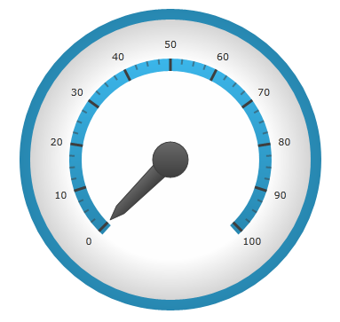
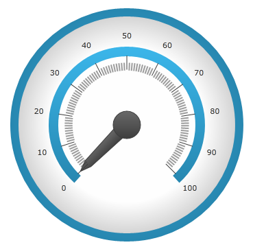

////
|metadata|
{
    "name": "radialgauge-configuring-tick-marks",
    "tags": ["Getting Started","How Do I"],
    "controlName": ["{RadialGaugeName}"],
    "guid": "c611b2f4-4ea0-44f2-b747-ac5fe44df5ac",
    "buildFlags": ["SL","WPF","XAMARIN","ANDROID","WINFORMS"],
    "createdOn": "2014-06-05T19:53:11.9828573Z"
}
|metadata|
////

= Configuring the Tick Marks ({RadialGaugeName})

== Topic Overview

=== Purpose

This topic provides a conceptual overview of tick marks with the  _{RadialGaugeName}_™ control. It describes the tick marks’ properties and provides an example of how to implement them.

=== Required background

The following topics are prerequisites to understanding this topic:

[options="header", cols="a,a"]
|====
|Topic|Purpose

| link:radialgauge.html[{RadialGaugeName}]
|This section gives you an overview of the _{RadialGaugeName}_™ control and its main features.

| link:radialgauge-getting-started-with-radialgauge.html[Adding {RadialGaugeName}]
|This topic explains using a code example how to add the _{RadialGaugeName}_™ control to a {PlatformName} application.

|====

=== In this topic

This topic contains the following sections:

* <<Overview,Tick Marks Overview>>
* <<Preview,Preview>>
* <<Properties,Tick Mark Properties>>
* <<Example,Configuring the Tick Marks>>
* <<RelatedContent,Related Content>>

[[Overview]]
== Tick Marks Overview

=== Tick marks overview

The radial gauge tick marks are visual elements displayed as lines at specified intervals on the gauge.

There are two types of tick marks, major and minor. Use the link:{RadialGaugeLink}.{RadialGaugeName}{ApiProp}minortickcount.html[MinorTickCount] property to specify the number of minor tick marks displayed between each major tick mark.

[[Preview]]

=== Preview

The next image is a preview of the  _{RadialGaugeName}_  with major and minor tick marks added.

[[Properties]]
== Tick Mark Properties

=== Tick mark properties summary

The following table summarizes the  _{RadialGaugeName}_  control’s tick marks properties.

[options="header", cols="a,a,a"]
|====
|Property Name|Property Type|Description

| link:{RadialGaugeLink}.{RadialGaugeName}{ApiProp}interval.html[Interval]
|`Double`
|Determines the scale interval of the major tick marks.

| link:{RadialGaugeLink}.{RadialGaugeName}{ApiProp}tickstartextent.html[TickStartExtent]
|`Double`
|Determines the start position of major tick marks, measured from the center of the gauge. The value of this property should be between 0 and 1 and only affects major tick marks. To change the extent of minor tick marks, use the link:{RadialGaugeLink}.{RadialGaugeName}{ApiProp}minortickstartextent.html[MinorTickStartExtent] property.

| link:{RadialGaugeLink}.{RadialGaugeName}{ApiProp}tickendextent.html[TickEndExtent]
|`Double`
|Determines the end position of major tick marks, measured from the center of the gauge. The value of this property should be between 0 and 1 and only affects major tick marks. To change the extent of minor tick marks, use the link:{RadialGaugeLink}.{RadialGaugeName}{ApiProp}minortickendextent.html[MinorTickEndExtent] property.

| link:{RadialGaugeLink}.{RadialGaugeName}{ApiProp}tickstrokethickness.html[TickStrokeThickness]
|`Double`
|Determines the stroke thickness of the major tick marks.

| link:{RadialGaugeLink}.{RadialGaugeName}{ApiProp}minortickstartextent.html[MinorTickStartExtent]
|`Double`
|Determines the position at which to start rendering the minor tick marks as a value from 0 to 1, measured from the center of the gauge. Values greater than 1 can be used to make this extend further than the normal radius of the gauge.

| link:{RadialGaugeLink}.{RadialGaugeName}{ApiProp}minortickendextent.html[MinorTickEndExtent]
|`Double`
|Determines the position at which to stop rendering the minor tick marks as a value from 0 to 1, measured from the center of the gauge. Values greater than 1 can be used to make this extend further than the normal radius of the gauge.

| link:{RadialGaugeLink}.{RadialGaugeName}{ApiProp}minortickcount.html[MinorTickCount]
|`Double`
|Determines the number of tick marks to place between two major tick marks.

| link:{RadialGaugeLink}.{RadialGaugeName}{ApiProp}minortickstrokethickness.html[MinorTickStrokeThickness]
|`Double`
|Determines the thickness of minor tick marks.

| link:{RadialGaugeLink}.{RadialGaugeName}{ApiProp}tickbrush.html[TickBrush]
|`Brush`
|Determines the brush of major tick marks. This property is used to change the brush of the major tick marks of the gauge scale.

| link:{RadialGaugeLink}.{RadialGaugeName}{ApiProp}minortickbrush.html[MinorTickBrush]
|`Brush`
|Determines the brush used for the minor tick marks. This property is used to change the brush of the minor tick marks of the gauge scale.

|====

[[Example]]
== Configuring the Tick Marks

=== Example

The screenshot below illustrates how the  _{RadialGaugeName}_  renders with its tick marks configured as follows:

[options="header", cols="a,a"]
|====
|Property|Value

| link:{RadialGaugeLink}.{RadialGaugeName}{ApiProp}tickstartextent.html[TickStartExtent]
|0.4

| link:{RadialGaugeLink}.{RadialGaugeName}{ApiProp}tickendextent.html[TickEndExtent]
|0.5

| link:{RadialGaugeLink}.{RadialGaugeName}{ApiProp}tickstrokethickness.html[TickStrokeThickness]
|1

| link:{RadialGaugeLink}.{RadialGaugeName}{ApiProp}minortickstartextent.html[MinorTickStartExtent]
|0.4

| link:{RadialGaugeLink}.{RadialGaugeName}{ApiProp}minortickendextent.html[MinorTickEndExtent]
|0.45

| link:{RadialGaugeLink}.{RadialGaugeName}{ApiProp}minortickcount.html[MinorTickCount]
|10

|====

Following is the code that implements this example

ifdef::xaml[]

*In XAML:*

[source,xaml]
----
<ig:{RadialGaugeName} x:Name="radialGauge"
                   TickStartExtent = “0.4”
                   TickEndExtent = “0.5”
                   TickStrokeThickness = “1”
                   MinorTickStartExtent = “0.4”
                   MinorTickEndExtent = “0.45”
                   MinorTickCount = “10” />
----

endif::xaml[]

ifdef::sl[]

*In C#:*

[source,csharp]
----
var radialGauge = new {RadialGaugeName}();
radialGauge.TickStartExtent = 0.4;
radialGauge.TickEndExtent = 0.5;
radialGauge.TickStrokeThickness = 1;
radialGauge.MinorTickStartExtent = 0.4;
radialGauge.MinorTickEndExtent = 0.45;
radialGauge.MinorTickCount = 10;
----

endif::sl[]

ifdef::wpf[]

*In C#:*

[source,csharp]
----
var radialGauge = new {RadialGaugeName}();
radialGauge.TickStartExtent = 0.4;
radialGauge.TickEndExtent = 0.5;
radialGauge.TickStrokeThickness = 1;
radialGauge.MinorTickStartExtent = 0.4;
radialGauge.MinorTickEndExtent = 0.45;
radialGauge.MinorTickCount = 10;
----

endif::wpf[]

ifdef::win-forms[]

*In C#:*

[source,csharp]
----
var radialGauge = new {RadialGaugeName}();
radialGauge.TickStartExtent = 0.4;
radialGauge.TickEndExtent = 0.5;
radialGauge.TickStrokeThickness = 1;
radialGauge.MinorTickStartExtent = 0.4;
radialGauge.MinorTickEndExtent = 0.45;
radialGauge.MinorTickCount = 10;
----

endif::win-forms[]

ifdef::win-universal[]

*In C#:*

[source,csharp]
----
var radialGauge = new {RadialGaugeName}();
radialGauge.TickStartExtent = 0.4;
radialGauge.TickEndExtent = 0.5;
radialGauge.TickStrokeThickness = 1;
radialGauge.MinorTickStartExtent = 0.4;
radialGauge.MinorTickEndExtent = 0.45;
radialGauge.MinorTickCount = 10;
----

endif::win-universal[]

ifdef::xamarin[]

*In C#:*

[source,csharp]
----
var radialGauge = new {RadialGaugeName}();
radialGauge.TickStartExtent = 0.4;
radialGauge.TickEndExtent = 0.5;
radialGauge.TickStrokeThickness = 1;
radialGauge.MinorTickStartExtent = 0.4;
radialGauge.MinorTickEndExtent = 0.45;
radialGauge.MinorTickCount = 10;
----

endif::xamarin[]

ifdef::sl[]

*In Visual Basic:*

[source,vb]
----
Dim radialGauge As {RadialGaugeName} = New {RadialGaugeName}
radialGauge.TickStartExtent = 0.4
radialGauge.TickEndExtent = 0.5
radialGauge.TickStrokeThickness = 1
radialGauge.MinorTickStartExtent = 0.4
radialGauge.MinorTickEndExtent = 0.45
radialGauge.MinorTickCount = 10
----

endif::sl[]

ifdef::wpf[]

*In Visual Basic:*

[source,vb]
----
Dim radialGauge As {RadialGaugeName} = New {RadialGaugeName}
radialGauge.TickStartExtent = 0.4
radialGauge.TickEndExtent = 0.5
radialGauge.TickStrokeThickness = 1
radialGauge.MinorTickStartExtent = 0.4
radialGauge.MinorTickEndExtent = 0.45
radialGauge.MinorTickCount = 10
----

endif::wpf[]

ifdef::win-forms[]

*In Visual Basic:*

[source,vb]
----
Dim radialGauge As {RadialGaugeName} = New {RadialGaugeName}
radialGauge.TickStartExtent = 0.4
radialGauge.TickEndExtent = 0.5
radialGauge.TickStrokeThickness = 1
radialGauge.MinorTickStartExtent = 0.4
radialGauge.MinorTickEndExtent = 0.45
radialGauge.MinorTickCount = 10
----

endif::win-forms[]

ifdef::win-universal[]

*In Visual Basic:*

[source,vb]
----
Dim radialGauge As {RadialGaugeName} = New {RadialGaugeName}
radialGauge.TickStartExtent = 0.4
radialGauge.TickEndExtent = 0.5
radialGauge.TickStrokeThickness = 1
radialGauge.MinorTickStartExtent = 0.4
radialGauge.MinorTickEndExtent = 0.45
radialGauge.MinorTickCount = 10
----

endif::win-universal[]

ifdef::xamarin[]

*In Visual Basic:*

[source,vb]
----
Dim radialGauge As {RadialGaugeName} = New {RadialGaugeName}
radialGauge.TickStartExtent = 0.4
radialGauge.TickEndExtent = 0.5
radialGauge.TickStrokeThickness = 1
radialGauge.MinorTickStartExtent = 0.4
radialGauge.MinorTickEndExtent = 0.45
radialGauge.MinorTickCount = 10
----

endif::xamarin[]

ifdef::android[]

*In Java:*

[source,js]
----
radialGauge.setTickStartExtent(.4);
radialGauge.setTickEndExtent(.5);
radialGauge.setTickStrokeThickness(1);
radialGauge.setMinorTickStartExtent(.4);
radialGauge.setMinorTickEndExtent(.45);
radialGauge.setMinorTickCount(10);
----

endif::android[]

[[RelatedContent]]
== Related Content

=== Topics

The following topics provide additional information related to this topic:

[options="header", cols="a,a"]
|====
|Topic|Purpose

| link:radialgauge-getting-started-with-radialgauge.html[Adding {RadialGaugeName}]
|This topic explains using a code example how to add the _{RadialGaugeName}_™ control to a {PlatformName} application.

| link:radialgauge-configuring-the-backing.html[Configuring the Background ({RadialGaugeName})]
|This topic provides a conceptual overview of the _{RadialGaugeName}_™ control’s backing feature. It describes the properties of the backing area and provides an example of its implementation.

| link:radialgauge-configuring-labels.html[Configuring Labels ({RadialGaugeName})]
|This topic provides a conceptual overview of labels with the {RadialGaugeName}™ control. It describes the properties of the labels and also provides an example of how to configure the labels.

| link:radialgauge-configuring-needles.html[Configuring Needles ({RadialGaugeName})]
|This topic provides a conceptual overview of needles with the {RadialGaugeName}™ control. It describes the properties of the needles and also provides an example of how to configure them.

| link:radialgauge-configuring-ranges.html[Configuring Ranges ({RadialGaugeName})]
|This topic provides a conceptual overview of the {RadialGaugeName}™ control’s ranges. It describes the properties of the ranges and provides an example of how to add ranges to the radial gauge.

| link:radialgauge-configuring-the-scale.html[Configuring the Scale ({RadialGaugeName})]
|This topic provides a conceptual overview of the {RadialGaugeName}™ control’s scale. It describes the properties of the scale and also provides an example of how to implement it.

|====

ifdef::sl[]

=== Samples

ifdef::sl,wpf[]
The following samples provide additional information related to this topic.
endif::sl,wpf[]

[options="header", cols="a,a"]
|====
|pick:[sl.wpf="Sample"] |pick:[sl.wpf="Purpose"] 

|pick:[sl,wpf=" link:{SamplesURL}/radial-gauge/#/bind-to-live-data[Bind to Live Data]"]
|
ifdef::sl,wpf[] 

In this sample, the gauge’s needle value is bound to live data and updated once every five seconds in the Tick event handler of a Timer. 

endif::sl,wpf[]

|pick:[sl,wpf=" link:{SamplesURL}/radial-gauge/#/events[Events]"]
|
ifdef::sl,wpf[] 

This sample demonstrates the Radial Gauge control’s events. You can watch the events in the Events Log below. 

endif::sl,wpf[]

|pick:[sl,wpf=" link:{SamplesURL}/radial-gauge/#/gauge-animation[Gauge Animation]"]
|pick:[sl,wpf="This sample demonstrates how you can easily animate the Radial Gauge by setting the"] pick:[sl,wpf=" link:{RadialGaugeLink}.{RadialGaugeName}~transitionduration.html[TransitionDuration]"] pick:[sl,wpf="property."]

|pick:[sl,wpf=" link:{SamplesURL}/radial-gauge/#/gauge-needle[Gauge Needle]"]
|
ifdef::sl,wpf[] 

Displayed as a pointer, the Needle indicates a single value on a scale. The options pane below allows you to interact with the Radial Gauge control’s Needle. 

endif::sl,wpf[]

|pick:[sl,wpf=" link:{SamplesURL}/radial-gauge/#/label-settings[Label Settings]"]
|pick:[sl,wpf="This sample demonstrates how to configure the Radial Gauge control’s Label settings. Use the slider to see how the"] pick:[sl,wpf=" link:{RadialGaugeLink}.{RadialGaugeName}~labelinterval.html[LabelInterval]"] pick:[sl,wpf="and"] pick:[sl,wpf=" link:{RadialGaugeLink}.{RadialGaugeName}~labelextent.html[LabelExtent]"] pick:[sl,wpf="properties affect the Label."]

|pick:[sl,wpf=" link:{SamplesURL}/radial-gauge/#/needle-dragging[Needle Dragging]"]
|
ifdef::sl,wpf[] 

This sample demonstrates how you can drag the Radial Gauge control’s needle by using the Mouse events. 

endif::sl,wpf[]

|pick:[sl,wpf=" link:{SamplesURL}/radial-gauge/#/range[Range]"]
|
ifdef::sl,wpf[] 

A range is a visual element that highlights a specified range of values on a scale. Use the options pane below to set the Radial Gauge control’s Range properties. 

endif::sl,wpf[]

|pick:[sl,wpf=" link:{SamplesURL}/radial-gauge/#/scale-settings[Scale Settings]"]
|
ifdef::sl,wpf[] 

A scale defines a range of values in the Radial Gauge. Use the options pane below to set the Radial Gauge control’s Scale properties. 

endif::sl,wpf[]

|pick:[sl,wpf=" link:{SamplesURL}/radial-gauge/#/tickmarks[Tick Marks]"]
|
ifdef::sl,wpf[] 

Tick marks can be displayed at every user specified interval on a gauge. Use the options pane below to set the Radial Gauge control’s Tick Mark properties. 

endif::sl,wpf[]

|====

endif::sl[]