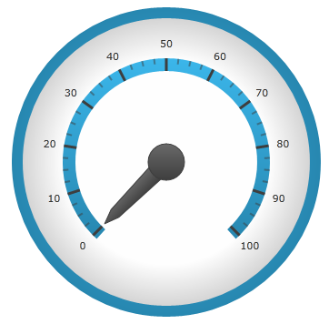

////
|metadata|
{
    "name": "radialgauge-getting-started-with-radialgauge",
    "tags": ["Getting Started","How Do I"],
    "controlName": ["{RadialGaugeName}"],
    "guid": "ea74c1c1-87da-4a46-aaa2-2a2572233abe",
    "buildFlags": ["SL","WPF","XAMARIN","ANDROID","WINFORMS"],
    "createdOn": "2014-06-05T19:53:11.967851Z"
}
|metadata|
////

= Adding {RadialGaugeName}

== Topic Overview

=== Purpose

This topic explains using a code example how to add the  _{RadialGaugeName}_™ control to {PlatformName} applications.

=== In this topic

This topic contains the following sections:

* <<Adding,Adding  _{RadialGaugeName}_   to the {PlatformName} application>>

** <<Introduction,Introduction>>
** <<Preview,Preview>>
** <<Prerequisites,Requirements>>
** <<Overview,Overview>>
** <<Steps,Steps>>

* <<RelatedContent,Related Content>>

[[Adding]]
== Adding  _{RadialGaugeName}_   to the {PlatformName} application

[[Introduction]]

=== Introduction

The following procedure demonstrates adding the  _{RadialGaugeName}_   to {PlatformName} applications.

[[Preview]]

=== Preview

The following is a screenshot of the  _{RadialGaugeName}_  .

[[Prerequisites]]

=== Requirements

Following are the general requirements for adding the  _{RadialGaugeName}_   control.

[options="header", cols="a,a"]
|====
|Requirement|Description

|Add assembly pick:[android="Jar"] references
|

[start=1] 

. Add the following Infragistics assemblies pick:[android="jars"] to your pick:[wpf,win-universal,android="*SampleApp*"] project: 

ifdef::sl,wpf,win-phone,win-universal[] 

** {ApiPlatform}Controls.Gauges{ApiVersion}.dll 

endif::sl,wpf,win-phone,win-universal[] 

ifdef::sl,wpf,win-phone,win-universal[] 

** {ApiPlatform}DataVisualization{ApiVersion}.dll 

endif::sl,wpf,win-phone,win-universal[] 

ifdef::android[] 

** Infragistics.Gauge jar 

endif::android[] 

ifdef::android[] 

** DV.Shared jar 

endif::android[] 

ifdef::android[] 

** Infragistics.Core.jar 

endif::android[] 

ifdef::android[] 

** Infragistics.UI.jar 

endif::android[] 

ifdef::xamarin[] 

** {ApiPlatform}Controls.Gauges{ApiVersion}.dll 

endif::xamarin[] 

ifdef::sl,wpf,win-phone,win-universal,xamarin[] 

** {ApiPlatform}v{ProductVersion}.dll 

endif::sl,wpf,win-phone,win-universal,xamarin[] 

ifdef::win-forms[] 

** {RadialGaugeNamespace}.Gauge.dll 

endif::win-forms[] 

ifdef::win-forms[] 

** {RadialGaugeNamespace}.Shared.dll 

endif::win-forms[] 

ifdef::win-forms[] 

** {ApiPlatform}Win.Portable{ApiVersion}.dll 

endif::win-forms[] 

ifdef::xamarin[] 

[start=2] 

. Add the following Infragistics assemblies to the *SampleApp.Android* project: 

** {ApiPlatform}Controls.Gauges.{ApiVersion}Android.dll 

** {ApiPlatform}Android.dll 

** InfragisticsAndroidBindings.dll 

endif::xamarin[] 

ifdef::xamarin[] 

[start=3] 

. Add Infragistics Unified (64-bit) or Classic (32-bit) assemblies to the *SampleApp.iOS* project: 

** {ApiPlatform}Controls.Gauges.{ApiVersion}iOS.dll 

** {ApiPlatform}iOS.dll 

** IG.Unified.dll 

** IGChart.Unified.dll 

or 

** {ApiPlatform}Controls.Gauges.{ApiVersion}iOS.Classic.dll 

** {ApiPlatform}iOS.Classic.dll 

** IG.Classic.dll 

** IGChart.Classic.dll 

endif::xamarin[] 

|Namespace references
|

ifdef::sl[] 

*In XAML:*

---- 
xmlns:ig="http://schemas.infragistics.com/xaml" 
---- 

endif::sl[] 

ifdef::wpf[] 

*In XAML:*

---- 
xmlns:ig="http://schemas.infragistics.com/xaml"
---- 

endif::wpf[] 

ifdef::xamarin[] 

*In XAML:*

---- 
xmlns:ig="clr-namespace:Infragistics.XF.Controls;assembly={ApiPlatform}Controls.Gauges"
---- 

endif::xamarin[] 

ifdef::win-universal[] 

*In XAML:*

---- 
xmlns:ig="http://schemas.infragistics.com/xaml"
---- 

endif::win-universal[] 

ifdef::xaml[] 

*In C#:*

[source,csharp]
---- 
using {RadialGaugeNamespace};
---- 

endif::xaml[] 

ifdef::win-forms[] 

*In C#:*

[source,csharp]
---- 
using {RadialGaugeNamespace};
---- 

endif::win-forms[] 

ifdef::xaml[] 

*In Visual Basic:*

[source,vb]
---- 
Imports {RadialGaugeNamespace}
---- 

endif::xaml[] 

ifdef::win-forms[] 

*In Visual Basic:*

[source,vb]
---- 
Imports {RadialGaugeNamespace}
---- 

endif::win-forms[] 

ifdef::android[] 

*In Java:*

[source,js]
---- 
import com.infragistics.controls.RadialGaugeView;
---- 

endif::android[] 

|====

[[Overview]]

=== Overview

Following is a conceptual overview of the process:

*1. Adding the {RadialGaugeName} control to {PlatformName} applications*

*2. Verifying the results*

[[Steps]]

=== Steps

The following procedure takes you through the steps necessary for adding the  _{RadialGaugeName}_  control to a page.

=== 1. Add the {RadialGaugeName} control to the page.

The following code demonstrates adding the  _{RadialGaugeName}_  control with the minimum code and property settings required for display:

ifdef::xaml[]

*In XAML:*

[source,xaml]
----
<Grid x:Name=”LayoutRoot”>
 <ig:{RadialGaugeName} x:Name=”Gauge” />
</Grid>
----

endif::xaml[]

ifdef::sl,wpf,win-forms,win-universal,xamarin[]

*In Visual Basic:*

ifdef::xaml[]
----
Dim radialGauge As New {RadialGaugeName}()
Me.LayoutRoot.Children.Add(radialGauge)  
----
endif::xaml[]

ifdef::win-forms[]
----
Dim radialGauge As New {RadialGaugeName}()
  Me.Controls.Add(radialGauge)
----
endif::win-forms[]

endif::sl,wpf,win-forms,win-universal,xamarin[]

ifdef::sl,wpf,win-forms,win-universal,xamarin[]

*In C#:*

ifdef::xaml[]
----
var radialGauge = new {RadialGaugeName}();
this.LayoutRoot.Children.Add(radialGauge);  
----
endif::xaml[]

ifdef::win-forms[]
----
var radialGauge = new {RadialGaugeName}();
  Me.Controls.Add(radialGauge);
----
endif::win-forms[]
endif::sl,wpf,win-forms,win-universal,xamarin[]

ifdef::android[]

*In Java:*

[source,js]
----
View rootView = inflater.inflate(R.layout.fragment_main, container, false);
RadialGaugeView radialGauge = new RadialGaugeView(rootView.getContext());
return (radialGauge);
----

endif::android[]

=== 2. Verify the results.

Build and run your project to verify the result. If you have implemented the steps correctly, the displayed {RadialGaugeName} should look like the one in the Preview section above.

[[_Ref348111483]]

[[RelatedContent]]

== Related Content

=== Topics

The following topics provide additional information related to this topic:

[options="header", cols="a,a"]
|====
|Topic|Purpose

| link:radialgauge-configuring-the-backing.html[Configuring the Background ({RadialGaugeName})]
|This topic provides a conceptual overview of the _{RadialGaugeName}_™ control’s backing feature. It describes the properties of the backing area and provides an example of its implementation.

| link:radialgauge-configuring-labels.html[Configuring Labels ({RadialGaugeName})]
|This topic provides a conceptual overview of labels with the {RadialGaugeName}™ control. It describes the properties of the labels and also provides an example of how to configure the labels.

| link:radialgauge-configuring-needles.html[Configuring Needles ({RadialGaugeName})]
|This topic provides a conceptual overview of needles with the {RadialGaugeName}™ control. It describes the properties of the needles and also provides an example of how to configure them.

| link:radialgauge-configuring-ranges.html[Configuring Ranges ({RadialGaugeName})]
|This topic provides a conceptual overview of the {RadialGaugeName}™ control’s ranges. It describes the properties of the ranges and provides an example of how to add ranges to the radial gauge.

| link:radialgauge-configuring-the-scale.html[Configuring the Scale ({RadialGaugeName})]
|This topic provides a conceptual overview of the {RadialGaugeName}™ control’s scale. It describes the properties of the scale and also provides an example of how to implement it.

| link:radialgauge-configuring-tick-marks.html[Configuring the Tick Marks ({RadialGaugeName})]
|This topic provides a conceptual overview of tick marks with the {RadialGaugeName}™ control. It describes the tick marks’ properties and provides an example of how to implement them.

|====

ifdef::sl[]

=== Samples

ifdef::sl,wpf[]
The following samples provide additional information related to this topic.
endif::sl,wpf[]

[options="header", cols="a,a"]
|====
|pick:[sl.wpf="Sample"] |pick:[sl.wpf="Purpose"] 

|pick:[sl,wpf=" link:{SamplesURL}/radial-gauge/#/bind-to-live-data[Bind to Live Data]"]
|
ifdef::sl,wpf[] 

In this sample, the gauge’s needle value is bound to live data and updated once every five seconds in the Tick event handler of a Timer. 

endif::sl,wpf[]

|pick:[sl,wpf=" link:{SamplesURL}/radial-gauge/#/events[Events]"]
|
ifdef::sl,wpf[] 

This sample demonstrates the Radial Gauge control’s events. You can watch the events in the Events Log below. 

endif::sl,wpf[]

|pick:[sl,wpf=" link:{SamplesURL}/radial-gauge/#/gauge-animation[Gauge Animation]"]
|pick:[sl,wpf="This sample demonstrates how you can easily animate the Radial Gauge by setting the"] pick:[sl,wpf=" link:{RadialGaugeLink}.{RadialGaugeName}~transitionduration.html[TransitionDuration]"] pick:[sl,wpf="property."]

|pick:[sl,wpf=" link:{SamplesURL}/radial-gauge/#/gauge-needle[Gauge Needle]"]
|
ifdef::sl,wpf[] 

Displayed as a pointer, the Needle indicates a single value on a scale. The options pane below allows you to interact with the Radial Gauge control’s Needle. 

endif::sl,wpf[]

|pick:[sl,wpf=" link:{SamplesURL}/radial-gauge/#/label-settings[Label Settings]"]
|pick:[sl,wpf="This sample demonstrates how to configure the Radial Gauge control’s Label settings. Use the slider to see how the"] pick:[sl,wpf=" link:{RadialGaugeLink}.{RadialGaugeName}~labelinterval.html[LabelInterval]"] pick:[sl,wpf="and"] pick:[sl,wpf=" link:{RadialGaugeLink}.{RadialGaugeName}~labelextent.html[LabelExtent]"] pick:[sl,wpf="properties affect the Label."]

|pick:[sl,wpf=" link:{SamplesURL}/radial-gauge/#/needle-dragging[Needle Dragging]"]
|
ifdef::sl,wpf[] 

This sample demonstrates how you can drag the Radial Gauge control’s needle by using the Mouse events. 

endif::sl,wpf[]

|pick:[sl,wpf=" link:{SamplesURL}/radial-gauge/#/range[Range]"]
|
ifdef::sl,wpf[] 

A range is a visual element that highlights a specified range of values on a scale. Use the options pane below to set the Radial Gauge control’s Range properties. 

endif::sl,wpf[]

|pick:[sl,wpf=" link:{SamplesURL}/radial-gauge/#/scale-settings[Scale Settings]"]
|
ifdef::sl,wpf[] 

A scale defines a range of values in the Radial Gauge. Use the options pane below to set the Radial Gauge control’s Scale properties. 

endif::sl,wpf[]

|pick:[sl,wpf=" link:{SamplesURL}/radial-gauge/#/tickmarks[Tick Marks]"]
|
ifdef::sl,wpf[] 

Tick marks can be displayed at every user specified interval on a gauge. Use the options pane below to set the Radial Gauge control’s Tick Mark properties. 

endif::sl,wpf[]

|====

endif::sl[]